```mermaid
flowchart TB
    subgraph current["EagleDiagnostics.csproj"]
        MAIN["<b>📦&nbsp;EagleDiagnostics.csproj</b><br/><small>net6.0-windows</small>"]
        click MAIN "#eaglediagnosticseaglediagnosticscsproj"
    end

```

# Projects and dependencies analysis

This document provides a comprehensive overview of the projects and their dependencies in the context of upgrading to .NETCoreApp,Version=v10.0.

## Table of Contents

- [Executive Summary](#executive-Summary)
  - [Highlevel Metrics](#highlevel-metrics)
  - [Projects Compatibility](#projects-compatibility)
  - [Package Compatibility](#package-compatibility)
  - [API Compatibility](#api-compatibility)
- [Aggregate NuGet packages details](#aggregate-nuget-packages-details)
- [Top API Migration Challenges](#top-api-migration-challenges)
  - [Technologies and Features](#technologies-and-features)
  - [Most Frequent API Issues](#most-frequent-api-issues)
- [Projects Relationship Graph](#projects-relationship-graph)
- [Project Details](#project-details)

  - [EagleDiagnostics\EagleDiagnostics.csproj](#eaglediagnosticseaglediagnosticscsproj)

## Executive Summary

### Highlevel Metrics

| Metric | Count | Status |
| :--- | :---: | :--- |
| Total Projects | 1 | All require upgrade |
| Total NuGet Packages | 2 | 1 need upgrade |
| Total Code Files | 13 |  |
| Total Code Files with Incidents | 14 |  |
| Total Lines of Code | 3289 |  |
| Total Number of Issues | 2831 |  |
| Estimated LOC to modify | 2829+ | at least 86.0% of codebase |

### Projects Compatibility

| Project | Target Framework | Difficulty | Package Issues | API Issues | Est. LOC Impact | Description |
| :--- | :---: | :---: | :---: | :---: | :---: | :--- |
| [EagleDiagnostics\EagleDiagnostics.csproj](#eaglediagnosticseaglediagnosticscsproj) | net6.0-windows | 🟡 Medium | 1 | 2829 | 2829+ | WinForms, Sdk Style = True |

### Package Compatibility

| Status | Count | Percentage |
| :--- | :---: | :---: |
| ✅ Compatible | 1 | 50.0% |
| ⚠️ Incompatible | 0 | 0.0% |
| 🔄 Upgrade Recommended | 1 | 50.0% |
| ***Total NuGet Packages*** | ***2*** | ***100%*** |

### API Compatibility

| Category | Count | Impact |
| :--- | :---: | :--- |
| 🔴 Binary Incompatible | 2770 | High - Require code changes |
| 🟡 Source Incompatible | 50 | Medium - Needs re-compilation and potential conflicting API error fixing |
| 🔵 Behavioral change | 9 | Low - Behavioral changes that may require testing at runtime |
| ✅ Compatible | 2713 |  |
| ***Total APIs Analyzed*** | ***5542*** |  |

## Aggregate NuGet packages details

| Package | Current Version | Suggested Version | Projects | Description |
| :--- | :---: | :---: | :--- | :--- |
| Newtonsoft.Json | 13.0.3 | 13.0.4 | [EagleDiagnostics.csproj](#eaglediagnosticseaglediagnosticscsproj) | NuGet package upgrade is recommended |
| ZedGraph | 5.2.0 |  | [EagleDiagnostics.csproj](#eaglediagnosticseaglediagnosticscsproj) | ✅Compatible |

## Top API Migration Challenges

### Technologies and Features

| Technology | Issues | Percentage | Migration Path |
| :--- | :---: | :---: | :--- |
| Windows Forms | 2770 | 97.9% | Windows Forms APIs for building Windows desktop applications with traditional Forms-based UI that are available in .NET on Windows. Enable Windows Desktop support: Option 1 (Recommended): Target net9.0-windows; Option 2: Add <UseWindowsDesktop>true</UseWindowsDesktop>; Option 3 (Legacy): Use Microsoft.NET.Sdk.WindowsDesktop SDK. |
| GDI+ / System.Drawing | 46 | 1.6% | System.Drawing APIs for 2D graphics, imaging, and printing that are available via NuGet package System.Drawing.Common. Note: Not recommended for server scenarios due to Windows dependencies; consider cross-platform alternatives like SkiaSharp or ImageSharp for new code. |
| Legacy Configuration System | 2 | 0.1% | Legacy XML-based configuration system (app.config/web.config) that has been replaced by a more flexible configuration model in .NET Core. The old system was rigid and XML-based. Migrate to Microsoft.Extensions.Configuration with JSON/environment variables; use System.Configuration.ConfigurationManager NuGet package as interim bridge if needed. |

### Most Frequent API Issues

| API | Count | Percentage | Category |
| :--- | :---: | :---: | :--- |
| T:System.Windows.Forms.ToolStripMenuItem | 328 | 11.6% | Binary Incompatible |
| T:System.Windows.Forms.ComboBox | 200 | 7.1% | Binary Incompatible |
| T:System.Windows.Forms.Button | 149 | 5.3% | Binary Incompatible |
| T:System.Windows.Forms.AnchorStyles | 115 | 4.1% | Binary Incompatible |
| T:System.Windows.Forms.ComboBox.ObjectCollection | 109 | 3.9% | Binary Incompatible |
| P:System.Windows.Forms.ComboBox.Items | 109 | 3.9% | Binary Incompatible |
| T:System.Windows.Forms.Label | 78 | 2.8% | Binary Incompatible |
| P:System.Windows.Forms.ToolStripMenuItem.Checked | 77 | 2.7% | Binary Incompatible |
| T:System.Windows.Forms.TextBox | 64 | 2.3% | Binary Incompatible |
| T:System.Windows.Forms.ListBox | 50 | 1.8% | Binary Incompatible |
| P:System.Windows.Forms.Control.Location | 44 | 1.6% | Binary Incompatible |
| T:System.Windows.Forms.Control.ControlCollection | 44 | 1.6% | Binary Incompatible |
| P:System.Windows.Forms.Control.Controls | 44 | 1.6% | Binary Incompatible |
| T:System.Windows.Forms.RadioButton | 42 | 1.5% | Binary Incompatible |
| P:System.Windows.Forms.ComboBox.SelectedIndex | 42 | 1.5% | Binary Incompatible |
| M:System.Windows.Forms.Control.ControlCollection.Add(System.Windows.Forms.Control) | 41 | 1.4% | Binary Incompatible |
| P:System.Windows.Forms.Control.Name | 41 | 1.4% | Binary Incompatible |
| P:System.Windows.Forms.Control.TabIndex | 38 | 1.3% | Binary Incompatible |
| P:System.Windows.Forms.Control.Size | 38 | 1.3% | Binary Incompatible |
| T:System.Windows.Forms.CheckBox | 35 | 1.2% | Binary Incompatible |
| T:System.Windows.Forms.DialogResult | 28 | 1.0% | Binary Incompatible |
| P:System.Windows.Forms.ToolStripItem.Text | 28 | 1.0% | Binary Incompatible |
| P:System.Windows.Forms.ToolStripItem.Size | 28 | 1.0% | Binary Incompatible |
| P:System.Windows.Forms.ToolStripItem.Name | 28 | 1.0% | Binary Incompatible |
| M:System.Windows.Forms.ToolStripMenuItem.#ctor | 28 | 1.0% | Binary Incompatible |
| P:System.Windows.Forms.ComboBox.ObjectCollection.Count | 25 | 0.9% | Binary Incompatible |
| E:System.Windows.Forms.ToolStripItem.Click | 25 | 0.9% | Binary Incompatible |
| T:System.Windows.Forms.Panel | 22 | 0.8% | Binary Incompatible |
| T:System.Windows.Forms.Timer | 22 | 0.8% | Binary Incompatible |
| T:System.Windows.Forms.Padding | 22 | 0.8% | Binary Incompatible |
| P:System.Windows.Forms.Control.Anchor | 21 | 0.7% | Binary Incompatible |
| M:System.Windows.Forms.ComboBox.ObjectCollection.Add(System.Object) | 21 | 0.7% | Binary Incompatible |
| T:System.Windows.Forms.RichTextBox | 20 | 0.7% | Binary Incompatible |
| P:System.Windows.Forms.ToolStripMenuItem.CheckOnClick | 20 | 0.7% | Binary Incompatible |
| T:System.Windows.Forms.MessageBox | 19 | 0.7% | Binary Incompatible |
| M:System.Windows.Forms.ComboBox.ObjectCollection.Remove(System.Object) | 19 | 0.7% | Binary Incompatible |
| M:System.Windows.Forms.ComboBox.ObjectCollection.IndexOf(System.Object) | 19 | 0.7% | Binary Incompatible |
| M:System.Windows.Forms.ComboBox.ObjectCollection.Contains(System.Object) | 19 | 0.7% | Binary Incompatible |
| M:System.Windows.Forms.MessageBox.Show(System.String) | 18 | 0.6% | Binary Incompatible |
| P:System.Windows.Forms.TextBox.Text | 17 | 0.6% | Binary Incompatible |
| P:System.Windows.Forms.ButtonBase.UseVisualStyleBackColor | 17 | 0.6% | Binary Incompatible |
| P:System.Windows.Forms.ButtonBase.Text | 17 | 0.6% | Binary Incompatible |
| T:System.Windows.Forms.MenuStrip | 15 | 0.5% | Binary Incompatible |
| T:System.Windows.Forms.ProgressBar | 14 | 0.5% | Binary Incompatible |
| T:System.Windows.Forms.OpenFileDialog | 14 | 0.5% | Binary Incompatible |
| F:System.Windows.Forms.AnchorStyles.Bottom | 13 | 0.5% | Binary Incompatible |
| T:System.Windows.Forms.AutoScaleMode | 12 | 0.4% | Binary Incompatible |
| F:System.Windows.Forms.AnchorStyles.Right | 12 | 0.4% | Binary Incompatible |
| F:System.Windows.Forms.AnchorStyles.Left | 12 | 0.4% | Binary Incompatible |
| M:System.Windows.Forms.Button.#ctor | 12 | 0.4% | Binary Incompatible |

## Projects Relationship Graph

Legend:
📦 SDK-style project
⚙️ Classic project

## Project Details

### EagleDiagnostics\EagleDiagnostics.csproj

#### Project Info

- **Current Target Framework:** net6.0-windows
- **Proposed Target Framework:** net10.0-windows
- **SDK-style**: True
- **Project Kind:** WinForms
- **Dependencies**: 0
- **Dependants**: 0
- **Number of Files**: 18
- **Number of Files with Incidents**: 14
- **Lines of Code**: 3289
- **Estimated LOC to modify**: 2829+ (at least 86.0% of the project)

#### Dependency Graph

Legend:
📦 SDK-style project
⚙️ Classic project

### API Compatibility

| Category | Count | Impact |
| :--- | :---: | :--- |
| 🔴 Binary Incompatible | 2770 | High - Require code changes |
| 🟡 Source Incompatible | 50 | Medium - Needs re-compilation and potential conflicting API error fixing |
| 🔵 Behavioral change | 9 | Low - Behavioral changes that may require testing at runtime |
| ✅ Compatible | 2713 |  |
| ***Total APIs Analyzed*** | ***5542*** |  |

#### Project Technologies and Features

| Technology | Issues | Percentage | Migration Path |
| :--- | :---: | :---: | :--- |
| Legacy Configuration System | 2 | 0.1% | Legacy XML-based configuration system (app.config/web.config) that has been replaced by a more flexible configuration model in .NET Core. The old system was rigid and XML-based. Migrate to Microsoft.Extensions.Configuration with JSON/environment variables; use System.Configuration.ConfigurationManager NuGet package as interim bridge if needed. |
| GDI+ / System.Drawing | 46 | 1.6% | System.Drawing APIs for 2D graphics, imaging, and printing that are available via NuGet package System.Drawing.Common. Note: Not recommended for server scenarios due to Windows dependencies; consider cross-platform alternatives like SkiaSharp or ImageSharp for new code. |
| Windows Forms | 2770 | 97.9% | Windows Forms APIs for building Windows desktop applications with traditional Forms-based UI that are available in .NET on Windows. Enable Windows Desktop support: Option 1 (Recommended): Target net9.0-windows; Option 2: Add <UseWindowsDesktop>true</UseWindowsDesktop>; Option 3 (Legacy): Use Microsoft.NET.Sdk.WindowsDesktop SDK. |

